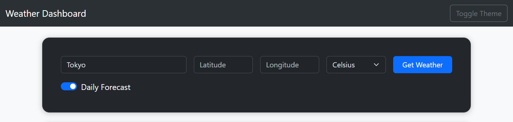
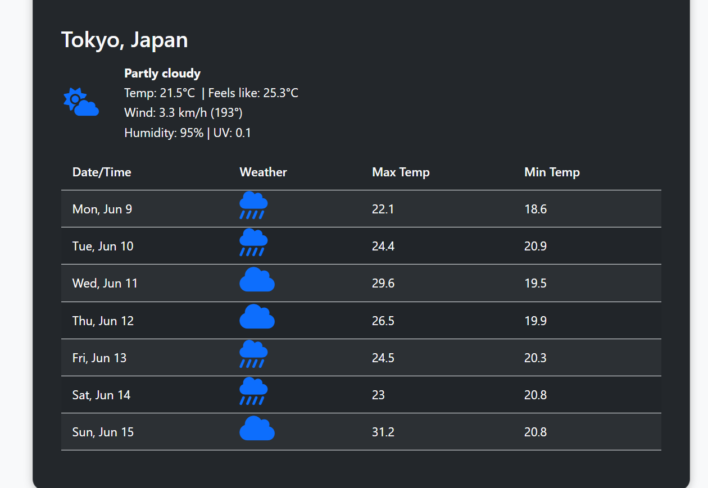

# Weather App

A sleek Flask-based weather app providing real-time conditions and detailed forecasts using the Open-Meteo API. Users can toggle temperature units, view hourly or daily forecasts, and see wind, precipitation, humidity, and UV index data.


## Installation

1. Clone the repository using: git clone and change into the project directory

2. Create and activate a virtual environment:
   - On macOS/Linux: python3 -m venv venv then source venv/bin/activate
   - On Windows: python3 -m venv venv then venv\Scripts\activate

3. Install dependencies by running: pip install -r requirements.txt

4. Run the app using: flask run

5. Open your browser and navigate to http://127.0.0.1:5000 to use the app.

# Usage Guide

Open your browser and navigate to `http://localhost:5000`.

1. **Enter a city name** (e.g., "London") or provide latitude and longitude.
2. **Choose your preferred units** (Celsius or Fahrenheit) and forecast type (hourly or daily).
3. **Click "Get Weather"** to view the weather dashboard.

---

### Search for a City


### Weather Results Display



## Example Output

**Sample API Request:**
```json
POST /api/weather
{
  "city": "Berlin",
  "units": "celsius",
  "forecast_type": "hourly"
}
```

**Sample API Response:**
```json
{
  "location": "Berlin, DE",
  "units": "celsius",
  "forecast_type": "hourly",
  "weather": {
    "current_weather": {
      "temperature_2m": 18.5,
      "apparent_temperature": 17.2,
      "weather_code": 1,
      "wind_speed_10m": 5.1,
      "wind_direction_10m": 250,
      "precipitation": 0.0,
      "relative_humidity_2m": 60,
      "uv_index": 3
    },
    ...
  }
}
```

---

## Features

- Search weather by city name or coordinates
- Supports both metric (Celsius, km/h) and imperial (Fahrenheit, mph) units
- Current, hourly, and daily forecast options
- Displays temperature, wind speed/direction, precipitation, humidity, and UV index
- Graceful error handling for invalid inputs and API failures

---

## Error Handling

- **Invalid City Name:**  
  Returns  
  ```json
  {"error": "City not found"}
  ```
  with HTTP 500.

- **Missing Location:**  
  Returns  
  ```json
  {"error": "No location provided"}
  ```
  with HTTP 400.

- **API Errors:**  
  Returns a descriptive error message and HTTP 500.

- **Form Validation:**  
  Ensures either a city or coordinates are provided.

---

## API Information

- **Weather Data:** Open-Meteo API

- **Endpoints used:**
  - Geocoding: `https://geocoding-api.open-meteo.com/v1/search`
  - Weather Forecast: `https://api.open-meteo.com/v1/forecast`

- **Authentication:**  
  No API key required for Open-Meteo.
